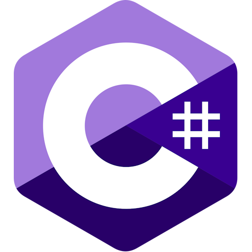
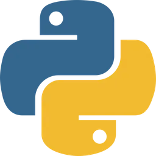
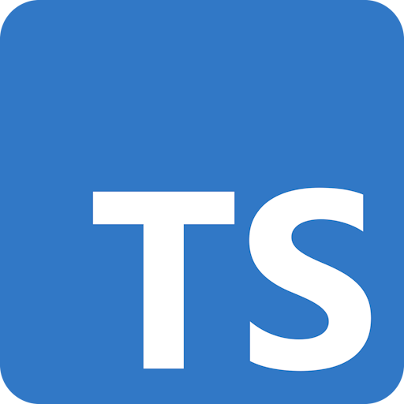
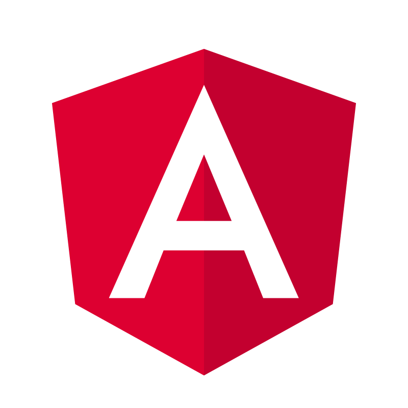
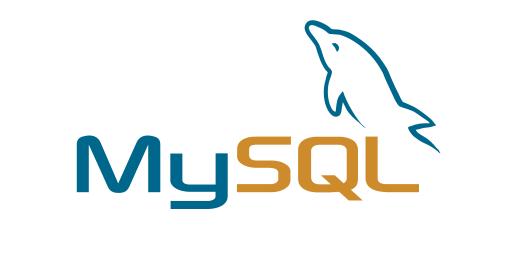
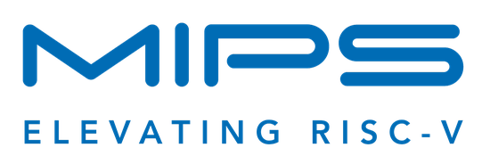
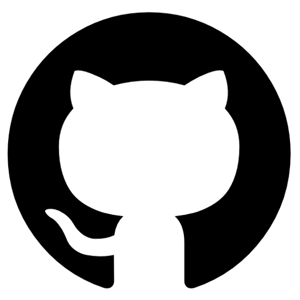

# 
Bienvenue ! 👋

Je m'appelle NOLLE Damien et je suis un étudiant en première année de Master Informatique, spécialité "Génie de l'Informatique Logicielle" (GIL), à l'université de Rouen. Mon objectif est de devenir développeur en informatique dans n'importe quel domaine impliquant le développement de logiciels, d'applications ou de sites web.

### 
<ins>Parcours :</ins>   

## 
Technologies :

### 
<ins>Langages de programmation :</ins>

    
    
    
    
    
    
    
    
    

 

### 
<ins>Langages de développement Web :</ins>

    
    
    
    
    
    
    
    
    
    
    

 

### 
<ins>Frameworks :</ins>

    
    
    
    
    
    
    

 

### 
<ins>API :</ins>

    
    
    

 

### 
<ins>Base de données :</ins>

    
    
    
    
    
    
    

 

### 
<ins>Programmation assembleur :</ins>

    

 

### 
<ins>CMS :</ins>

    

 

### 
<ins>Dépôt :</ins>

    
    
    

#

2024 @ NOLLE Damien

